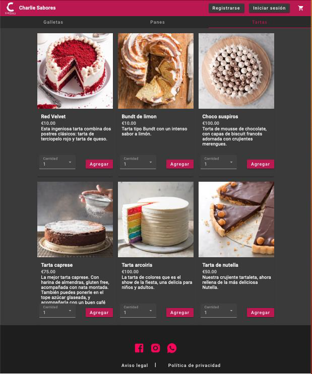

# Charlie Sabores

Charlie Sabores is a (hypothetical) e-Commerce project that sells pastries. Features include user authentication (register, login), role-based authorization, a JSON web token refresh strategy, Stripe payment system. It is implemented using NestJS on the backend and Angular on the frontend.

An example deploy on AWS can be seen here: [CharlieSaboresExample](http://34.224.98.21)

## Home View Example:

